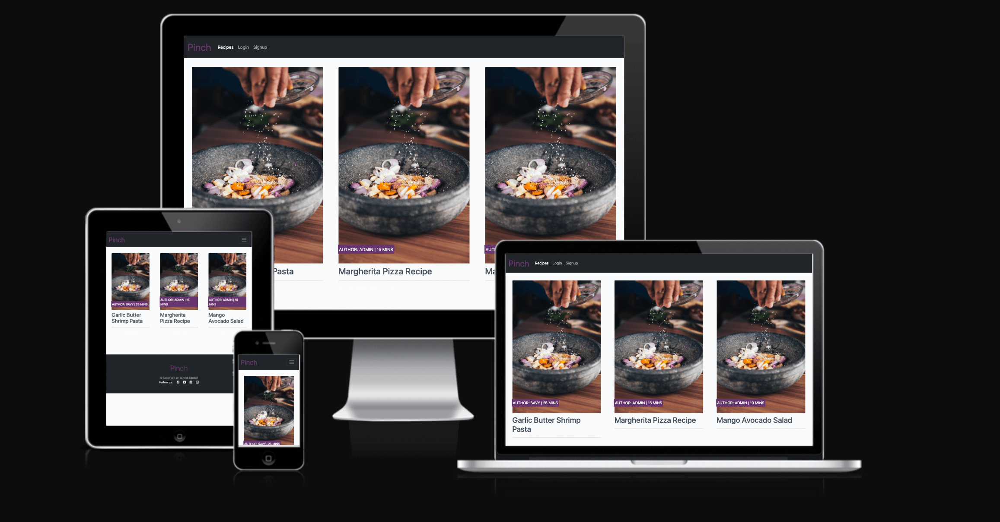

# **Introduction**

"Pinch" is a simple recipe blog developed using Django. Users can view and interact with recipes, leave comments, and like their favorite recipes. User's can also share their favourite recipes to the world!

This interactive platform is designed to be an inspiration for those struggling with ideas on what to eat, or if you are simply craving something new and fresh.

## **User Experience (UX)**

### The Site's Ideal User

- Recipe Discovery: Users aim to discover new and exciting recipes to try, expanding their culinary repertoire.

- Community Engagement: Users seek to engage with a like-minded community, sharing their passion for cooking, and connecting with fellow food enthusiasts.

- Personalization: Users want the ability to personalize their profiles, showcasing their favorite recipes, culinary preferences, and achievements.

- Recipe Contribution: Enthusiastic cooks aspire to contribute their unique recipes to the platform, sharing their culinary creations with the community.

- Feedback and Recognition: Users look for feedback and recognition from the community, acknowledging their cooking skills and creativity.

- Learning and Improvement: Users strive to enhance their cooking skills and knowledge by exploring new recipes, techniques, and cooking tips shared by others.

### Site Goals

- Culinary Community Building: Foster a thriving community of food enthusiasts, encouraging interaction, collaboration, and engagement among users.

- Recipe Sharing and Recognition: Provide a platform for users to share their favorite recipes and receive acknowledgment and recognition from the community.

- User Registration and Profiles: Enable users to register on the site, creating personalized profiles that showcase their culinary interests, contributions, and achievements.

- Interactive Features: Implement features such as commenting, liking, and sharing to enhance user interaction with recipes and contribute to a dynamic community experience.

- Intuitive User Interface: Develop a user-friendly interface that ensures a seamless and enjoyable experience for users to explore, discover, and contribute recipes effortlessly.

## Agile Development

### Epics & User Stories

| Type          | Name                                        | Description                                                                                                                                      |
|---------------|---------------------------------------------|--------------------------------------------------------------------------------------------------------------------------------------------------|
| Epic          | User Management   | This epic will cover the user management side, such as registration, profile & logging in/out.                                     |
| User Story          | User Registration  | As a User i can register an account so that comment & like posts.      |
| User Story          |  User Authentication | As a Site User i can log in or out so that i can interact with the posts.                                                                                     |
| User Story    | User Profile | As a Site User i can add or edit my profile picture so that i can have an identity on the site.                                                                                |
| Epic   |  Admin Panel  | This epic will cover the admin utilities at hand.                                                     |
| User Story    | Manage Content   |   As a Site Admin i can approve or disapprove comments so that the content is suitable to the aim of the blog.                                               |
| User Story    | Manage Post   | As a Site Admin i can create, read, update and delete posts so that I can manage my blog content.                                                                                         |
| Epic   | Interaction & Engagement  | This epic will cover the blog's interactive features.                                                                                 |
| User Story    | View Post   | As a Site User i can view a list of posts so that i can select one to read.                                                     |
| User Story    | Post Details   | As a Site User i can click on a post  so that i can read the full recipe.                                                                                          |
| User Story    | Like a Post                             | As a Site User i can like or unlike a post so that interact with the content.                                                                                                      |
| User Story    | Comment on Recipe   | As a Site User i can leave comments on a post so that I can be involved in the conversation.                                                           |
| User Story    | Read Comments    | As a Site User / Admin i can view comments on an individual post so that read the conversation.                                                                                  |
|Epic   | Recipe Managment   | This epic will cover the User's management over their own recipes.                                                                                         |
| User Story    | Add Recipe    | As a Site User i can Add a recipe when logged in so that add to my profile.                                                                                 |
| User Story    | Edit / Delete Recipes    | As a Site User i can delete/edit my own recipe post whilst logged in so that manage my content.         |

## Design

### Colour Scheme

White backgrounds provide a clean and neutral canvas that enhances text readability. The dark grey navbar and footer create a strong visual contrast, making navigation elements and important information stand out. The combination of white, dark grey, and purple can convey a sense of professionalism and elegance. This is particularly important for a platform that revolves around recipes, as it reflects a sophisticated and tasteful aesthetic.

### Typography

The Lato font is the main font used throughout the whole website with Sans Serif as the fallback font in case for any reason the font isn't being imported into the site correctly. Lato is picked for it's readbility and cleaness when added to the website.

## Features

### User Registration and Profiles

- Allow users to create accounts to personalize their experience.
- Allow users to long in and out.

### Recipe Upload and Management

- Enable users to upload their own recipes with details such as ingredients, instructions, and estimated time.

### Recipe Exploration

- Implement a paginated list of recipes for the user to view.

### Likes and Comments

- Allow users to like recipes they enjoy.
- Include a comment section for each recipe to facilitate user interaction.
- Implement a comment approval system to maintain quality and community standards.
- Allow users to comment on recipes.
- Display the number of likes & comments for each recipe.

## Future Enhancements

- Add the option for logged in users to edit and delete their own comments.
- Advanced Search & Filters: Enhanced search functionalities will allow users to filter recipes based on specific criteria.
- User Registration and Profiles: Users can create profiles, add avatars, and include a brief bio.
- Recipe Exploration:
  - - Implement a robust search and filter system to help users discover recipes based on cuisine, dietary preferences, difficulty level, etc.
  - - Provide categories and tags for easy navigation.
- Recipe Ratings:
  - - Allow users to rate recipes based on their experience.
  - - Display average ratings for each recipe.

## Technologies Used

### Languages Used

- HTML5
- CSS
- Javascript
- Python
- Django
- Bootstrap
- ElephantSQL
- Heroku
- Summernote
- Crispy Forms
- Django-allauth
- Font Awesome:
- Font Awesome was used for the facilities the footer section to add icons for aesthetic and UX purposes.
- Git
- Git was used for version control by utilizing the Gitpod terminal to commit to Git and Push to GitHub.
- GitHub:
- GitHub is used to store the projects code after being pushed from Git.

## Testing

### Manual Testing

| Epic                  | User Story               | Description                                                                                      | Manual Testing | Test Result |
|-----------------------|--------------------------|--------------------------------------------------------------------------------------------------|----------------|-------------|
| User Management       | User Registration        | As a User, I can register an account so that I can comment & like posts.                         | ✅              | Passed      |
| User Management       | User Authentication      | As a Site User, I can log in or out so that I can interact with the posts.                       | ✅              | Passed      |
| User Management       | User Profile             | As a Site User, I can add or edit my profile picture so that I can have an identity on the site. | ❌              | Failed     |
| Admin Panel           | Manage Content           | As a Site Admin, I can approve or disapprove comments so that the content is suitable.           | ✅              | Passed      |
| Admin Panel           | Manage Post              | As a Site Admin, I can create, read, update and delete posts.                                     | ✅              | Passed      |
| Interaction & Engagement | View Post              | As a Site User, I can view a list of posts so that I can select one to read.                     | ✅              | Passed      |
| Interaction & Engagement | Post Details           | As a Site User, I can click on a post so that I can read the full recipe.                        | ✅              | Passed      |
| Interaction & Engagement | Like a Post            | As a Site User, I can like or unlike a post to interact with the content.                        | ✅              | Passed      |
| Interaction & Engagement | Comment on Recipe      | As a Site User, I can leave comments on a post to be involved in the conversation.                | ✅              | Passed      |
| Interaction & Engagement | Read Comments          | As a Site User / Admin, I can view comments on an individual post.                                | ✅              | Passed      |
| Recipe Management      | Add Recipe               | As a Site User, I can add a recipe when logged in to add to my profile.                          | ✅              | Passed      |
| Recipe Management      | Edit / Delete Recipes   | As a Site User, I can delete/edit my own recipe post whilst logged in.                            | ✅              | Passed      |

### Features Testing

In addition to the manual testing, i have conducted further test on the different features of the website to make sure everything works as intended.

#### Navigation Bar - User Logged Out

| Status | Feature                                                      |
|--------|--------------------------------------------------------------|
| ✓      | Clicking the navbar logo loads the home page                 | 
| ✓      | Navbar shows nav links for Recipes, Login & SignUp Register  |
| ✓      | Clicking the Recipe tab on the navbar loads the recipe page      |
| ✓      | Clicking the Login tab on the navbar loads the Login page & form    |
| ✓      | Clicking the SignUp tab on the navbar loads the SignUp page & form      |
| ✓      | Mobile view shows navigation in burger menu |
| ✓      | An alert message is displayed confirming they have logged out |

#### Navigation Bar - User Logged In

| Status | Feature                                                                    |
|--------|----------------------------------------------------------------------------|
| ✓      | Navbar operations load the relevant page as described for user logged out |
| ✓      | Navbar shows the Pinch logo, Recipes, Add Recipe & Logout tabs |
| ✓      | Clicking the Logout tab on the navbar loads the logout page |
| ✓      | Mobile view shows navigation in burger menu |
| ✓      | An alert message is displayed confirming they have logged in |

#### Footer - User Logged Out/In

| Status | Feature                                     |
|--------|---------------------------------------------|
| ✓      | Clicking the Facebook/icon loads Facebook   |
| ✓      | Clicking the Twitter/icon loads Twitter     |
| ✓      | Clicking the Instagram/icon loads Instagram |
| ✓      | Clicking the Youtube/icon loads Youtube     |

#### Recipes Page

| Status | Feature                                                |
|--------|--------------------------------------------------------|
| ✓      | Shows recipes posts paginated by 6 posts; prev/next works |
| ✓      | Clicking on the post title loads the detail of recipe page |
| ✓      | Mobile view shows recipes post paginated by 6 posts |

#### Recipe Detail Page

| Status | Feature                                                     |
|--------|-------------------------------------------------------------|
| ✓      | Shows the full content of the recipe                         |
| ✓      | Shows a list of comments posted so far             |
| ✓      | Comment box is visible when signed in only        |
| ✓      | Like icon works only when the user is logged in      |
| ✓      | Edit/delete buttons are visible only for user's own recipe     |
| ✓      | Back button visible & directs the user back to the recipes page   |
| ✓      | Comment box not visible when not logged in     |
| ✓      | Cannot like a recipe when not logged in      |

#### Add a Recipe - User Logged In

| Status | Feature                                                                     |
|--------|-----------------------------------------------------------------------------|
| ✓      | All required fields are validated                                           |
| ✓      | Form submission creates a post author field automatically                   |
| ✓      | User is redirected to the 'Recipes page' with a success message after posting  |

#### Edit Post - User Logged In

| Status | Feature                                                         |
|--------|-----------------------------------------------------------------|
| ✓      | User can see content input field already populated                 |
| ✓      | Clicking Update button, updates the recipe content                |
| ✓      | Estimated time cannot go into negative numbers             |
| ✓      | An alert message informs the user that their recipe was updated   |

#### Delete Recipe - User Logged In

| Status | Feature                                                                   |
|--------|---------------------------------------------------------------------------|
| ✓      | User can see a confirmation message with recipe title for deletion request |
| ✓      | Clicking the Delete button redirects back to the recipes list page      |
| ✓      | An alert message informs the user of successful post deletion             |
| ✓      | The post is completely deleted from the database and the website         |

### Bugs

- Ingredients listed do not show in correct format. Tried a if loop, plus an unordered list. Was unable to correct the code.

### Responsiveness

- Chrome Developer Tools used to check throughout the development.

### Browser Compatibility

- Tests were done to make sure the website worked smoothly in different browsers (Google Chrome, Internet Explorer & Microsoft Edge).

### Validator Testing

- The W3C Markup Validator and W3C CSS Validator Services were used to validate every page of the project to ensure there were no syntax errors /styling errors in the project. Using PEP 8 validators only files with custom-written Python code have been verified with the validator.

#### HTML Validation

- Result for [home page](./assets/testing/W3C-home-page.png)
 - Result for [login page](./assets/testing/W3C-login-page.png)
 - Result for [logout page](./assets/testing/W3C-logout-page.png)
 - Result for [signup page](./assets/testing/W3C-signup-page.png)
 - Result for [add recipe page](./assets/testing/W3C-add-recipe-page.png)
 - Result for [edit recipe page](./assets/testing/W3C-edit-recipe-page.png)
 - Result for [delete recipe page](./assets/testing/W3C-delete-recipe-page.png)

 #### CSS Validation 

 - The result can be seen [here](./assets/testing/css-validator.png).

### Lighthouse Results

## Deployment

### GitHub Pages

The Recipie website was developed in Gitpod, hosted on GitHub, and deployed via Heroku. The deployment process is outlined below:

### Setting up in Gitpod

1. Initialization with the Code Institute Template.
2. Setup of the GitHub Repository.
3. Regular commits and pushes to the GitHub repository.

### Heroku Deployment

1. Creation of the Heroku App.
2. Configuring Environment Variables.
3. Enabling Automatic Deployment.

## Credits

- The main code of this project is based on the Code Institute tutorial "I Think Therefore I Blog" with changes made to suit my project.
- stackoverflow
- w3schools
- Django Documentation
- Bootstrap Documentation

## Acknowledgements

- My Mentor for continuous helpful feedback.
- The slack community for all there advice and guidance.
